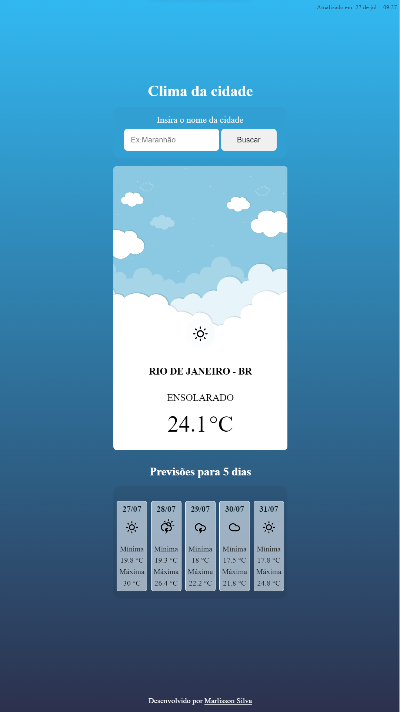

<h1 align="center"> City Weather </h1>

Aplicação com consumo de dados da AccuWeather API
 

 

  

## 🚀 Tecnologias

Esse projeto foi desenvolvido com as seguintes tecnologias:

- HTML
- Sass(CSS)
- JavaScript
- Git e Github

## ✍️ Descrição

Aplicação de consumo da AccuWeather API, trazendo informações do clima da cidade inserida no input, e com a previsão de 5 dias mostrando a temperatura mínima e máxima de cada dia. 

- [Visite o projeto online](https://marlissonsilva.github.io/city-weather/)
